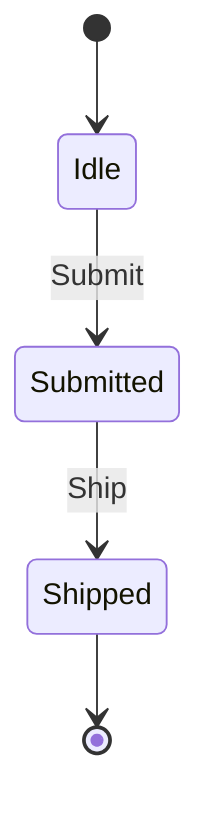

# Diagram Export

`[StateMachine(Diagram = true)]` (and `[StateMachineGroup(Diagram = true)]`)
asks the generator to emit a **Mermaid `stateDiagram-v2`** rendering of the
machine's transitions next to the dispatcher. The diagram lands on the
partial as a `public const string MermaidDiagram` — paste it into any
Mermaid-aware renderer (GitHub, Markdown previewers, docs sites) to view it.

---

## Why

The transition graph is already fully declared in `[Transition]` attributes;
keeping a hand-drawn diagram in sync with the attributes is busywork that
rots. `Diagram = true` lets the source of truth — the attributes — drive a
human-readable picture at zero runtime cost (it's a compile-time string
literal).

---

## How

Add `Diagram = true` to the machine attribute:

```csharp
using ZeroAlloc.StateMachine;

public enum OrderState   { Idle, Submitted, Shipped }
public enum OrderTrigger { Submit, Ship }

[StateMachine(InitialState = nameof(OrderState.Idle), Diagram = true)]
[Transition<OrderState, OrderTrigger>(From = OrderState.Idle,      On = OrderTrigger.Submit, To = OrderState.Submitted)]
[Transition<OrderState, OrderTrigger>(From = OrderState.Submitted, On = OrderTrigger.Ship,   To = OrderState.Shipped)]
[Terminal<OrderState>(State = OrderState.Shipped)]
public partial class Order { }
```

The generated partial gains a constant you can read at runtime:

```csharp
Console.WriteLine(Order.MermaidDiagram);
```

The emitted string is:



---

## What gets rendered

| Feature | Rendering |
|---|---|
| **Initial state** | `[*] --> InitialState` |
| **Flat transitions** | `From --> To: Trigger` |
| **Guards** (`When = true`) | `From --> To: Trigger [guard]` |
| **Timed edges** (`AfterMs = N`) | `From --> To: Trigger (after Nms)` |
| **Terminal states** (`[Terminal]`) | `State --> [*]` |
| **Composite states** | `state Parent { ... }` nested block, with the sub-FSM's own diagram inside |
| **Shallow history** (`[HistoryState]`) | `state H as History` marker inside the composite block |
| **Concurrent parts** (`[StateMachineGroup]`) | one top-level `state PartName { ... }` block per `[StateMachinePart]` |

The output is a string literal — no reflection, no runtime cost, AOT-safe.

If `Diagram = true` is set on a class with zero transitions, the generator
emits [ZSM0020](../diagnostics/ZSM0020.md) — the resulting `MermaidDiagram`
would be empty.

---

## Example: composite with history

```csharp
[StateMachine(InitialState = nameof(LoadStep.Fetching))]
[Transition<LoadStep, AppTrigger>(From = LoadStep.Fetching, On = AppTrigger.Tick,     To = LoadStep.Parsing)]
[Transition<LoadStep, AppTrigger>(From = LoadStep.Parsing,  On = AppTrigger.Complete, To = LoadStep.Done)]
[Terminal<LoadStep>(State = LoadStep.Done)]
public partial class LoadingFsm { }

[StateMachine(InitialState = nameof(AppState.Idle), Diagram = true)]
[Transition<AppState, AppTrigger>(From = AppState.Idle,    On = AppTrigger.Begin,    To = AppState.Loading)]
[Transition<AppState, AppTrigger>(From = AppState.Loading, On = AppTrigger.Complete, To = AppState.Ready)]
[Terminal<AppState>(State = AppState.Ready)]
[CompositeState<AppState>(State = AppState.Loading, SubMachine = typeof(LoadingFsm))]
[HistoryState<AppState>(State = AppState.Loading)]
public partial class App { }
```

`App.MermaidDiagram` renders as:

```mermaid
stateDiagram-v2
    [*] --> Idle
    Idle --> Loading: Begin
    Loading --> Ready: Complete
    Ready --> [*]
    state Loading {
        state H as History
        [*] --> Fetching
        Fetching --> Parsing: Tick
        Parsing --> Done: Complete
        Done --> [*]
    }
```

---

## Related

- [States and Triggers](states-and-triggers.md) — the enum surface that names diagram nodes and edges
- [Composite States](composite-states.md) — nested rendering and `[HistoryState]`
- [Concurrent Parts](concurrent-parts.md) — group rendering as side-by-side blocks
- [Attribute Reference — `Diagram`](../attributes.md)
- [ZSM0020](../diagnostics/ZSM0020.md) — `Diagram = true` with no transitions
